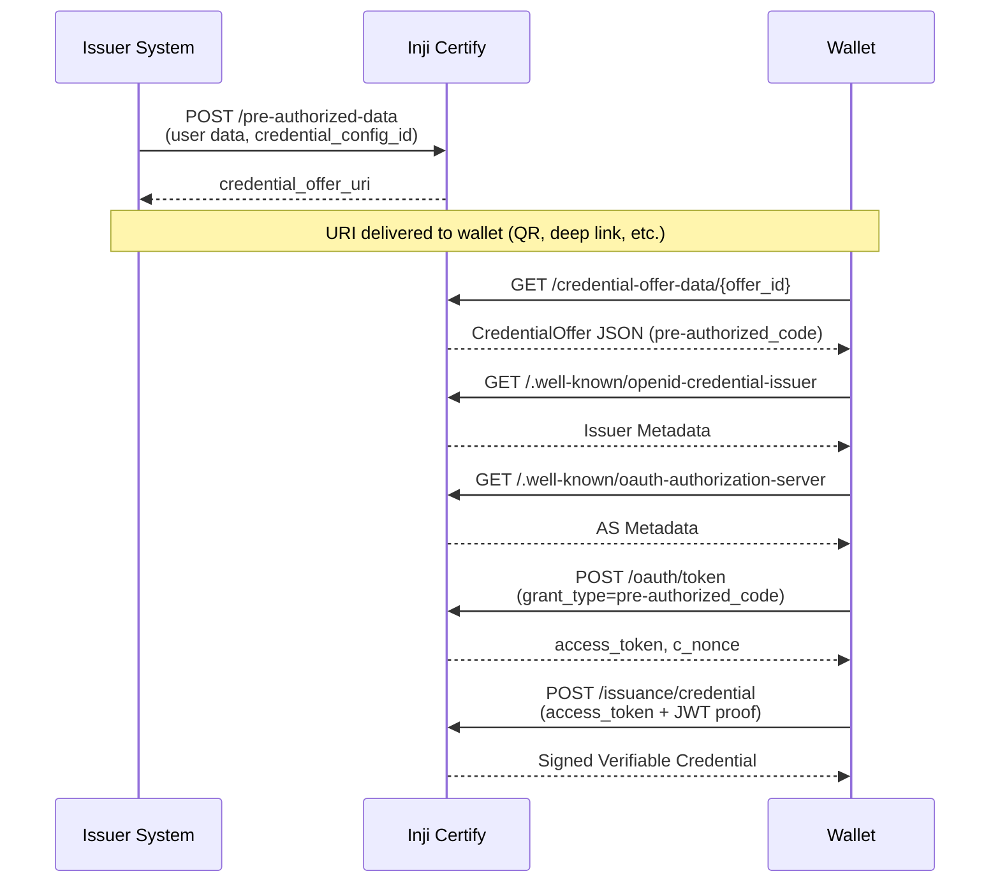

# Project Handover — Inji Certify: Pre-Authorized Code + Student Backend

> **Handover Date**: 29 August 2026  
> **Status**: Original files restored ✅ | Student backend in place ✅ | API key design pending ⏳

---

## Table of Contents

1. [What This Project Is](#what-this-project-is)
2. [Architecture](#architecture)
3. [Pre-Authorized Code Flow (Original)](#pre-authorized-code-flow-original)
4. [Student Backend (inji-usecase)](#student-backend-inji-usecase)
5. [File Directory — Where Everything Lives](#file-directory)
6. [Configuration Deep Dive](#configuration-deep-dive)
7. [Database Schema](#database-schema)
8. [Postman Setup](#postman-setup)
9. [Docker Setup](#docker-setup)
10. [What's Done vs What's Next](#whats-done-vs-whats-next)
11. [Restoration Log](#restoration-log)

---

## What This Project Is

**Inji Certify** is MOSIP's credential issuance platform that issues **Verifiable Credentials (VCs)** using the **OpenID4VCI** standard.

We're building a **Student Graduation Credential** use-case on top of it:
- A university stores student + graduation data in PostgreSQL
- The **Pre-Authorized Code Flow** is used to issue VCs to students (no interactive login needed)
- The **inji-usecase** Spring Boot service provides a REST API to manage student data (CRUD)

The next step is to **design API keys** for the backend so it integrates flawlessly with the pre-authorized code flow.

---

## Architecture

```
┌─────────────┐     HTTP      ┌──────────────────┐    SQL Query    ┌────────────────┐
│   Postman /  │ ──────────►  │   Inji Certify   │ ─────────────► │   PostgreSQL   │
│   Wallet     │              │   (port 8090)    │                │  (port 5433)   │
│   (Client)   │ ◄──────────  │                  │ ◄───────────── │                │
│              │   Signed VC  │  Postgres Data   │   Student +    │ certify schema │
│              │              │  Provider Plugin │   Graduation   │                │
└─────────────┘              └──────────────────┘    Data         └────────────────┘
                                                                          ▲
                                                                          │ CRUD
                                                                   ┌──────┴───────┐
                                                                   │ inji-usecase │
                                                                   │  (port 8085) │
                                                                   │ Spring Boot  │
                                                                   └──────────────┘
```

### Key Components

| Component | Port | Purpose |
|-----------|------|---------|
| **Inji Certify** | 8090 | Core VC issuance engine (pre-auth code, token, credential endpoints) |
| **inji-usecase** | 8085 | Student data management REST API (CRUD for students + graduation) |
| **PostgreSQL** | 5433 | Shared database (`inji_certify` DB, `certify` schema) |
| **Certify Nginx** | 443 | Reverse proxy for HTTPS (via ngrok for external access) |

---

## Pre-Authorized Code Flow (Original)

This is the **original, unmodified** flow as committed in the repository.

### What It Does

The Pre-Authorized Code Flow lets an issuer create a **credential offer** for a user. The user (via wallet) redeems this offer to get a signed Verifiable Credential — **without interactive login**.

### Endpoints (6 total)

| # | Method | Endpoint | Purpose |
|---|--------|----------|---------|
| 1 | `GET` | `/.well-known/openid-credential-issuer` | Issuer metadata discovery (credential types, endpoints) |
| 2 | `GET` | `/.well-known/oauth-authorization-server` | OAuth AS metadata (token endpoint, grant types, JWKS) |
| 3 | `POST` | `/pre-authorized-data` | Push user data → get `credential_offer_uri` |
| 4 | `GET` | `/credential-offer-data/{offer_id}` | Wallet fetches offer → gets `pre-authorized_code` |
| 5 | `POST` | `/oauth/token` | Exchange pre-authorized code → get `access_token` + `c_nonce` |
| 6 | `POST` | `/issuance/credential` | Use access token + JWT proof → get signed VC |

### Flow Sequence



### Key Implementation Classes

| Class | Location | Role |
|-------|----------|------|
| [`PreAuthorizedCodeController`](file:///c:/Projects/MosipInji/certify-service/src/main/java/io/mosip/certify/controller/PreAuthorizedCodeController.java) | Controller | Handles `/pre-authorized-data` and `/credential-offer-data/{offer_id}` |
| [`OAuthController`](file:///c:/Projects/MosipInji/certify-service/src/main/java/io/mosip/certify/controller/OAuthController.java) | Controller | Handles `/oauth/token` (both authorization_code and pre-authorized_code grants) |
| [`VCIssuanceController`](file:///c:/Projects/MosipInji/certify-service/src/main/java/io/mosip/certify/controller/VCIssuanceController.java) | Controller | Handles `/issuance/credential` |
| [`PreAuthorizedCodeService`](file:///c:/Projects/MosipInji/certify-service/src/main/java/io/mosip/certify/services/PreAuthorizedCodeService.java) | Service | Core logic: generates codes, builds offers, exchanges codes for tokens |
| [`PreAuthIssuanceServiceImpl`](file:///c:/Projects/MosipInji/certify-service/src/main/java/io/mosip/certify/services/PreAuthIssuanceServiceImpl.java) | Service | `DataProviderPlugin` for `PreAuthDataProviderPlugin` — returns cached claims as VC data |
| [`VCICacheService`](file:///c:/Projects/MosipInji/certify-service/src/main/java/io/mosip/certify/services/VCICacheService.java) | Service | Manages cache for pre-auth codes, credential offers, and transactions |
| [`AccessTokenJwtUtil`](file:///c:/Projects/MosipInji/certify-service/src/main/java/io/mosip/certify/utils/AccessTokenJwtUtil.java) | Utility | JWT access token creation and validation |
| [`WellKnownController`](file:///c:/Projects/MosipInji/certify-service/src/main/java/io/mosip/certify/controller/WellKnownController.java) | Controller | `.well-known` endpoints |

### Key DTOs

| DTO | Location | Purpose |
|-----|----------|---------|
| [`PreAuthorizedRequest`](file:///c:/Projects/MosipInji/certify-core/src/main/java/io/mosip/certify/core/dto/PreAuthorizedRequest.java) | Input to `/pre-authorized-data` |
| [`PreAuthorizedResponse`](file:///c:/Projects/MosipInji/certify-core/src/main/java/io/mosip/certify/core/dto/PreAuthorizedResponse.java) | Response with `credential_offer_uri` |
| [`CredentialOfferResponse`](file:///c:/Projects/MosipInji/certify-core/src/main/java/io/mosip/certify/core/dto/CredentialOfferResponse.java) | Credential offer JSON |
| [`PreAuthCodeData`](file:///c:/Projects/MosipInji/certify-core/src/main/java/io/mosip/certify/core/dto/PreAuthCodeData.java) | Cached pre-auth code data |
| [`PreAuthTransaction`](file:///c:/Projects/MosipInji/certify-core/src/main/java/io/mosip/certify/core/dto/PreAuthTransaction.java) | Transaction after code exchange |
| [`OAuthTokenRequest`](file:///c:/Projects/MosipInji/certify-core/src/main/java/io/mosip/certify/core/dto/OAuthTokenRequest.java) | Token exchange request |
| [`OAuthTokenResponse`](file:///c:/Projects/MosipInji/certify-core/src/main/java/io/mosip/certify/core/dto/OAuthTokenResponse.java) | Token exchange response |
| [`Grant`](file:///c:/Projects/MosipInji/certify-core/src/main/java/io/mosip/certify/core/dto/Grant.java) | Grant object in credential offer |
| [`TxCode`](file:///c:/Projects/MosipInji/certify-core/src/main/java/io/mosip/certify/core/dto/TxCode.java) | Transaction code config |

### Two Plugin Modes

| Plugin | When to use | How it works |
|--------|-------------|-------------|
| `PreAuthDataProviderPlugin` | Claims passed directly in Step 1 | Caches claims → returns them as VC data in Step 4 |
| `PostgresDataProviderPlugin` | Only an ID is passed in Step 1 | Uses ID to query PostgreSQL → returns DB data as VC |

> [!IMPORTANT]
> For the **student flow**, we use `PostgresDataProviderPlugin`. You pass `student_id` in claims, and the SQL query fetches all 15 fields from DB.
> For the **farmer flow**, you use `PreAuthDataProviderPlugin` or `MockCSVDataProviderPlugin`. All claim data is passed directly.

---

## Student Backend (inji-usecase)

A standalone **Spring Boot** service for managing student data. Runs on **port 8085**.

### API Endpoints

#### Students (`/api/students`)

| Method | Endpoint | Description |
|--------|----------|-------------|
| `POST` | `/api/students` | Create a new student |
| `GET` | `/api/students` | Get all students |
| `GET` | `/api/students/{studentId}` | Get student by student_id (e.g., `STU-2022-001`) |
| `PUT` | `/api/students/{studentId}` | Update student |
| `DELETE` | `/api/students/{studentId}` | Delete student |

#### Graduation (`/api/students/{studentId}/graduation`)

| Method | Endpoint | Description |
|--------|----------|-------------|
| `POST` | `/api/students/{studentId}/graduation` | Add graduation details for a student |
| `GET` | `/api/students/{studentId}/graduation` | Get graduation details by student |
| `PUT` | `/api/graduation/{uuid}` | Update graduation record by UUID |
| `DELETE` | `/api/graduation/{uuid}` | Delete graduation record by UUID |
| `GET` | `/api/graduation/search?year=&status=&registrationNumber=` | Search graduation records |

### Sample Students (pre-loaded in DB)

| student_id | Name | Program | Status | Has Graduation? |
|-----------|------|---------|--------|-----------------|
| `STU-2022-001` | Aarav Sharma | B.Tech Computer Science | ACTIVE | ✅ PENDING |
| `STU-2022-002` | Priya Patel | B.Tech Electronics | ACTIVE | ✅ PENDING |
| `STU-2021-003` | Rahul Verma | M.Tech AI | GRADUATED | ✅ ISSUED |
| `STU-2023-004` | Ananya Reddy | B.Sc Data Science | ACTIVE | ❌ |
| `STU-2020-005` | Vikram Singh | B.Tech Mechanical | GRADUATED | ✅ ISSUED |

---

## File Directory

### 🔧 Certify Core (Pre-Auth Code Implementation)

```
certify-core/src/main/java/io/mosip/certify/core/
├── constants/
│   ├── Constants.java          ← Grant type strings, cache names
│   └── ErrorConstants.java     ← Error codes for pre-auth flow
├── dto/
│   ├── PreAuthorizedRequest.java
│   ├── PreAuthorizedResponse.java
│   ├── PreAuthCodeData.java
│   ├── PreAuthTransaction.java
│   ├── CredentialOfferResponse.java
│   ├── Grant.java
│   ├── TxCode.java
│   ├── OAuthTokenRequest.java
│   ├── OAuthTokenResponse.java
│   └── OAuthAuthorizationServerMetadataDTO.java
└── validation/
    └── OAuthTokenRequestValidator.java  ← Validates token requests
```

### 🔧 Certify Service (Controllers + Services)

```
certify-service/src/main/java/io/mosip/certify/
├── controller/
│   ├── PreAuthorizedCodeController.java   ← /pre-authorized-data, /credential-offer-data
│   ├── OAuthController.java               ← /oauth/token, /oauth/iar, /.well-known/oauth-*
│   ├── VCIssuanceController.java          ← /issuance/credential
│   └── WellKnownController.java           ← /.well-known/openid-credential-issuer
├── services/
│   ├── PreAuthorizedCodeService.java      ← Core pre-auth logic (432 lines)
│   ├── PreAuthIssuanceServiceImpl.java    ← DataProviderPlugin for PreAuthDataProviderPlugin
│   ├── VCICacheService.java               ← Cache operations for pre-auth codes/offers/transactions
│   ├── CertifyIssuanceServiceImpl.java    ← VC issuance logic
│   ├── CredentialConfigurationServiceImpl.java ← Credential config management
│   └── OAuthAuthorizationServerMetadataService.java
├── utils/
│   ├── AccessTokenJwtUtil.java            ← JWT access token generation
│   └── VCIssuanceUtil.java
└── resources/
    └── application-local.properties       ← Local dev configuration
```

### 🔧 Docker Compose Stack (Config Files)

```
docker-compose/docker-compose-injistack/
├── docker-compose.yaml                              ← Main Docker Compose file
├── certify_init.sql                                  ← DB init (schema + credential configs)
├── certify-nginx.conf                                ← Nginx reverse proxy
└── config/
    ├── certify-default.properties                    ← Core Certify configuration
    ├── certify-csvdp-farmer.properties               ← Farmer CSV data provider config
    ├── certify-postgres-student.properties  [NEW]    ← Student Postgres data provider config
    └── vp_request_config.json
```

### 🔧 Student Backend (inji-usecase)

```
inji-usecase/
├── pom.xml                              ← Maven build
├── Dockerfile                           ← Multi-stage Docker build (port 8085)
├── docker-compose.yml                   ← Standalone Postgres for local dev
├── Inji_Student_API_Tests.postman_collection.json  ← Postman tests for CRUD APIs
├── init/
│   ├── 1-init.sql                       ← Creates student_management database
│   ├── 2-student-schema.sql             ← Creates schema + tables
│   └── 3-sample-data.sql               ← 5 students + 4 graduation records
└── src/main/java/com/mosip/inji_usecase/
    ├── InjiDataCreationApp.java         ← Spring Boot main
    ├── config/
    │   ├── CorsConfig.java
    │   └── GlobalExceptionHandler.java
    ├── controller/
    │   └── StudentDataController.java   ← All REST endpoints
    ├── dto/student/
    │   ├── StudentDto.java
    │   └── StudentGraduationDto.java
    ├── entity/student/
    │   ├── Student.java                 ← JPA entity → certify.students table
    │   └── StudentGraduationDetail.java ← JPA entity → certify.student_graduation_details
    ├── mapper/student/
    │   ├── StudentMapper.java           ← MapStruct: Student ↔ StudentDto
    │   └── StudentGraduationMapper.java
    ├── repository/student/
    │   ├── StudentRepository.java
    │   └── StudentGraduationRepository.java
    └── service/
        ├── StudentService.java
        └── StudentGraduationService.java
```

### 📄 Documentation

```
docs/
├── Pre-Authorized-Code.md                              ← Official pre-auth flow documentation
├── student-preauth-walkthrough/
│   └── README.md                                        ← Step-by-step testing guide
└── postman-collections/
    ├── Inji Certify - Pre Auth Code.postman_collection.json      ← Pre-auth flow collection
    ├── Inji-certify-pre-auth-code.postman_environment.json       ← Farmer environment
    ├── certify-student-pre-auth.postman_environment.json [NEW]   ← Student environment
    └── ... (other collections)
```

### 🧪 Test Scripts (can be cleaned up)

```
(root)
├── test_pre_auth_flow.py         ← Python test for pre-auth flow
├── test_jwt.js                   ← JWT testing script
├── decode_collection.py          ← Postman collection decoder
├── postman-pmlib-code.js         ← Postman pre-request script helper
└── issued_credential.json        ← Sample issued credential
```

---

## Configuration Deep Dive

### How Certify Knows About Students

Three files work together:

#### 1. [`certify-default.properties`](file:///c:/Projects/MosipInji/docker-compose/docker-compose-injistack/config/certify-default.properties) (ORIGINAL — RESTORED)

This is the **core** config file. Key pre-auth settings:

```properties
# OAuth AS properties (COMMENTED OUT in original — Certify uses eSignet as AS)
#mosip.certify.authorization.url=${mosip.certify.domain.url}
#mosip.certify.authn.issuer-uri=${mosip.certify.authorization.url}

# Pre-auth code expiry
mosip.certify.pre-auth-code.default-expiry-seconds=600
mosip.certify.pre-auth-code.min-expiry-seconds=60
mosip.certify.pre-auth-code.max-expiry-seconds=3600

# Credential offer URL
mosip.certify.credential-offer-url=${mosip.certify.domain.url}${server.servlet.path}/credential-offer-data/
```

> [!IMPORTANT]
> To use Certify **as its own OAuth Authorization Server** (required for standalone pre-auth without eSignet), you must **uncomment** these 4 lines:
> ```properties
> mosip.certify.authorization.url=${mosip.certify.domain.url}
> mosip.certify.authn.issuer-uri=${mosip.certify.authorization.url}
> mosip.certify.authn.jwk-set-uri=${mosip.certify.authorization.url}${server.servlet.path}/.well-known/jwks.json
> mosip.certify.authn.allowed-audiences={ '${mosip.certify.authorization.url}${server.servlet.path}/issuance/credential' }
> ```
> **AND** add `credentialOfferCache` to the cache names + size + expiry maps.

#### 2. [`certify-postgres-student.properties`](file:///c:/Projects/MosipInji/docker-compose/docker-compose-injistack/config/certify-postgres-student.properties) (NEW)

Student-specific config. The critical piece is the **scope-to-query mapping**:

```properties
mosip.certify.integration.data-provider-plugin=PostgresDataProviderPlugin
mosip.certify.data-provider-plugin.postgres.scope-query-mapping={\
    'student_graduation_vc_ldp': 'SELECT s.student_id, s.full_name, ... \
        FROM certify.students s JOIN certify.student_graduation_details g \
        ON s.id = g.student_id WHERE s.student_id = :id ...'\
}
```

#### 3. [`certify_init.sql`](file:///c:/Projects/MosipInji/docker-compose/docker-compose-injistack/certify_init.sql) (ORIGINAL — RESTORED)

Creates DB schema. To add student tables, the SQL for `certify.students`, `certify.student_graduation_details`, sample data, and the `StudentGraduationCredential` credential config needs to be **re-added** when ready.

> [!WARNING]
> The init SQL was restored to original. The student table DDL and credential config INSERT that were previously added will need to be re-applied. You can find the original additions in the [previous changes report](file:///C:/Users/ACER/.gemini/antigravity-ide/brain/528b82ea-c6a6-46ca-afd6-2564eaa8663b/pre_auth_changes_report.md).

---

## Database Schema

### Student Tables (to be added to `certify_init.sql`)

```sql
-- Table: certify.students
CREATE TABLE certify.students (
    id                  UUID PRIMARY KEY DEFAULT gen_random_uuid(),
    student_id          VARCHAR(50) NOT NULL UNIQUE,      -- e.g., STU-2022-001
    full_name           VARCHAR(200) NOT NULL,
    email               VARCHAR(255) NOT NULL UNIQUE,
    phone_number        VARCHAR(20) NOT NULL,
    date_of_birth       DATE NOT NULL,
    address             TEXT NOT NULL,
    course_program      VARCHAR(150) NOT NULL,
    enrollment_date     DATE NOT NULL,
    academic_year       VARCHAR(20) NOT NULL,
    cgpa                NUMERIC(3,2),
    guardian_name       VARCHAR(200) NOT NULL,
    guardian_phone      VARCHAR(20) NOT NULL,
    status              VARCHAR(20) NOT NULL DEFAULT 'ACTIVE',
    created_at          TIMESTAMP DEFAULT CURRENT_TIMESTAMP,
    updated_at          TIMESTAMP DEFAULT CURRENT_TIMESTAMP
);

-- Table: certify.student_graduation_details
CREATE TABLE certify.student_graduation_details (
    id                      UUID PRIMARY KEY DEFAULT gen_random_uuid(),
    student_id              UUID NOT NULL REFERENCES certify.students(id) ON DELETE CASCADE,
    registration_number     VARCHAR(100) NOT NULL UNIQUE,
    degree_title            VARCHAR(200) NOT NULL,
    graduation_month        SMALLINT NOT NULL CHECK (graduation_month BETWEEN 1 AND 12),
    graduation_year         INTEGER NOT NULL,
    classification          VARCHAR(100) NOT NULL,
    certificate_status      VARCHAR(20) NOT NULL DEFAULT 'PENDING',
    created_at              TIMESTAMP DEFAULT CURRENT_TIMESTAMP,
    updated_at              TIMESTAMP DEFAULT CURRENT_TIMESTAMP
);
```

---

## Postman Setup

### Collections to Import

| File | Location | Purpose |
|------|----------|---------|
| `Inji Certify - Pre Auth Code.postman_collection.json` | [`docs/postman-collections/`](file:///c:/Projects/MosipInji/docs/postman-collections) | Pre-auth code flow (4 steps) |
| `Inji_Student_API_Tests.postman_collection.json` | [`inji-usecase/`](file:///c:/Projects/MosipInji/inji-usecase) | Student CRUD API tests |

### Environments to Import

| File | `credential_config_id` | When to use |
|------|----------------------|-------------|
| [`certify-student-pre-auth.postman_environment.json`](file:///c:/Projects/MosipInji/docs/postman-collections/certify-student-pre-auth.postman_environment.json) | `StudentGraduationCredential` | Student flow |
| [`Inji-certify-pre-auth-code.postman_environment.json`](file:///c:/Projects/MosipInji/docs/postman-collections/Inji-certify-pre-auth-code.postman_environment.json) | `FarmerCredential` | Farmer flow |

### Testing the Student Pre-Auth Flow

```
Step 1: POST /pre-authorized-data
  Body: { "credential_configuration_id": "StudentGraduationCredential",
          "claims": { "studentId": "STU-2022-001" },
          "expires_in": 600, "tx_code": "12345" }

Step 2: GET /credential-offer-data/{{offer_id}}
  → Returns pre-authorized_code

Step 3: POST /oauth/token
  → Returns access_token + c_nonce

Step 4: POST /issuance/credential
  Body: { "format": "ldp_vc",
          "credential_definition": { "type": ["VerifiableCredential","StudentGraduationCredential"] },
          "proof": { "proof_type": "jwt", "jwt": "{{proof_jwt}}" } }
  → Returns signed VC with 15 student+graduation fields
```

---

## Docker Setup

### Start Everything

```powershell
cd c:\Projects\MosipInji\docker-compose\docker-compose-injistack
docker compose up -d
```

### Verify Services

```powershell
# Check all containers are running
docker ps

# Check Certify logs
docker logs <certify-container> --tail 50

# Check DB has student tables
docker exec -it <db-container> psql -U postgres -d inji_certify -c "SELECT student_id, full_name FROM certify.students;"
```

### Ports

| Service | Port |
|---------|------|
| Certify | 8090 |
| inji-usecase | 8085 |
| PostgreSQL | 5433 |
| Nginx (HTTPS) | 443 |

---

## What's Done vs What's Next

### ✅ Done

| Item | Status |
|------|--------|
| Pre-Authorized Code Flow (original, in repo) | ✅ Working |
| Student backend (`inji-usecase`) with full CRUD API | ✅ Built |
| PostgreSQL data provider config (`certify-postgres-student.properties`) | ✅ Written |
| Student DB schema (SQL) | ✅ Written |
| `StudentGraduationCredential` credential config | ✅ Written |
| Postman environment for student testing | ✅ Created |
| Postman collection for student API CRUD tests | ✅ Created |
| Walkthrough documentation | ✅ Written |
| **Original files restored to repo state** | ✅ Restored |

### ⏳ Next: API Key Design for Backend

> [!IMPORTANT]
> **This is the main pending task.** The student backend (`inji-usecase` on port 8085) currently has **no authentication**. Anyone can call its CRUD endpoints.
>
> You need to design and implement API key-based authentication so that:
> 1. The `inji-usecase` REST API is protected by API keys
> 2. API keys work seamlessly with the pre-authorized code flow
> 3. The Issuer Portal (which calls `/pre-authorized-data`) can authenticate properly
>
> **Key considerations:**
> - Where to store API keys (database table? environment variable?)
> - How to validate keys (Spring Security filter? interceptor?)
> - How to pass keys (header `X-API-Key`? Bearer token?)
> - Key rotation/revocation strategy
> - How the API key integrates with Certify's `/pre-authorized-data` endpoint

### Other Pending Items

| Item | Notes |
|------|-------|
| Integrate `inji-usecase` into the main `docker-compose.yaml` | Was removed during restoration — needs clean re-integration |
| Add `postgres-student` Spring profile to Certify's active profiles | Same — needs re-addition to `docker-compose.yaml` |
| Add student tables + credential config to `certify_init.sql` | Same — SQL is documented above, needs re-addition |
| Uncomment OAuth AS properties in `certify-default.properties` | Required for standalone pre-auth without eSignet |
| Add `credentialOfferCache` to cache config in `certify-default.properties` | Required for credential offer caching |
| Replace `did:web:YOUR_NGROK_URL` with actual DID URL | In `certify-postgres-student.properties` and `certify_init.sql` |
| Remove test/debug files from root | `test_pre_auth_flow.py`, `test_jwt.js`, etc. |

---

## Restoration Log

The following files were **restored to their original committed state** on 29 Aug 2026:

| File | What was reverted |
|------|-------------------|
| [`certify-default.properties`](file:///c:/Projects/MosipInji/docker-compose/docker-compose-injistack/config/certify-default.properties) | Removed `credentialOfferCache` from caches, re-commented OAuth AS properties, removed debug logging |
| [`certify-csvdp-farmer.properties`](file:///c:/Projects/MosipInji/docker-compose/docker-compose-injistack/config/certify-csvdp-farmer.properties) | Reverted plugin from `PreAuthDataProviderPlugin` back to `MockCSVDataProviderPlugin` |
| [`docker-compose.yaml`](file:///c:/Projects/MosipInji/docker-compose/docker-compose-injistack/docker-compose.yaml) | Removed `postgres-student` profile, removed `inji-usecase` service |
| [`certify_init.sql`](file:///c:/Projects/MosipInji/docker-compose/docker-compose-injistack/certify_init.sql) | Removed student tables, sample data, and `StudentGraduationCredential` credential config |

### Files NOT removed (kept as-is)

These are **new, untracked** files that don't affect existing functionality:

- `docker-compose/docker-compose-injistack/config/certify-postgres-student.properties`
- `inji-usecase/` (entire directory)
- `docs/postman-collections/certify-student-pre-auth.postman_environment.json`
- `docs/student-preauth-walkthrough/`
- Various test/debug scripts in root

---

> **For the detailed walkthrough on testing the student flow step-by-step**, see: [`docs/student-preauth-walkthrough/README.md`](file:///c:/Projects/MosipInji/docs/student-preauth-walkthrough/README.md)
>
> **For the official pre-auth code documentation**, see: [`docs/Pre-Authorized-Code.md`](file:///c:/Projects/MosipInji/docs/Pre-Authorized-Code.md)
